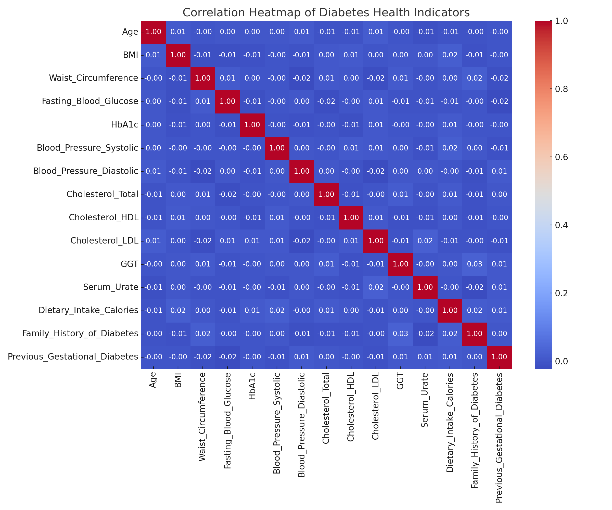
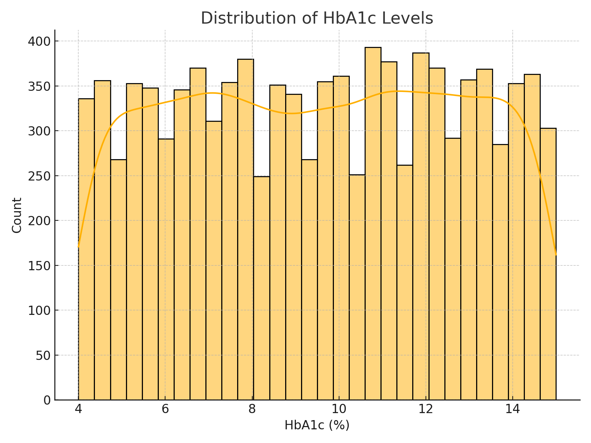
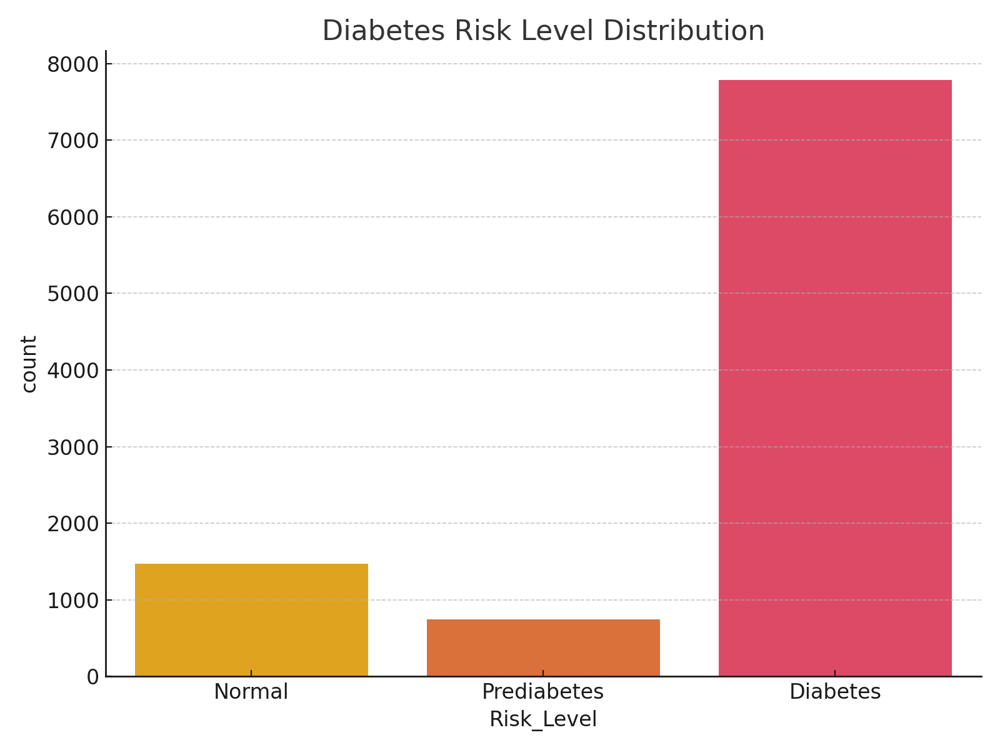

# 🩺 Diabetes Risk Analysis – Exploratory Data Project

This project analyzes a synthetic healthcare dataset of 10,000 individuals to explore patterns and risk factors associated with diabetes. We use visual and statistical analysis to uncover how biometric and lifestyle indicators impact health risk levels such as prediabetes and diabetes.

---

## 📌 Objectives

- Analyze relationships between **HbA1c**, **BMI**, **glucose**, and other health indicators
- Explore risk segmentation based on **HbA1c levels**
- Visualize impact of gender, physical activity, and lifestyle factors on diabetes risk
- Identify insights that can be useful for healthcare professionals or patients

---

## 🛠️ Tech Stack

- **Python** (Pandas, Matplotlib, Seaborn)
- **Jupyter Notebook**
- Dataset format: CSV (synthetic healthcare data)

---
## 📊 Sample Visualizations

### 🔬 Correlation Heatmap
Visualizes the strength of relationships between biometric indicators like BMI, HbA1c, and blood glucose.

### 🧪 HbA1c Distribution
Shows the overall distribution of HbA1c levels, indicating potential risk zones for prediabetes and diabetes.

### 📉 Risk Level Distribution
Categorizes individuals into Normal, Prediabetes, or Diabetes based on HbA1c levels.

### 👥 Average HbA1c by Gender
Highlights how average HbA1c levels vary between male and female participants.

