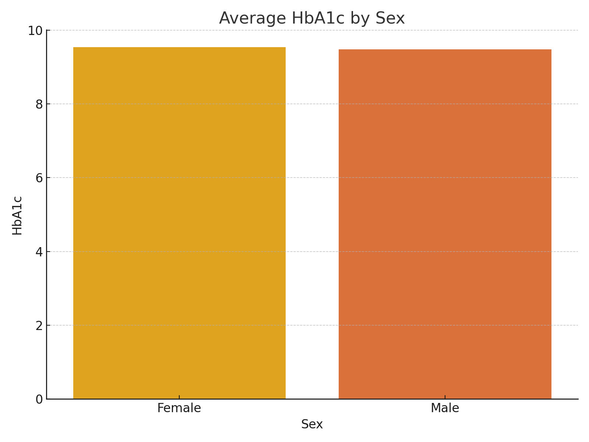

# 🩺 Diabetes Risk Analysis – Exploratory Data Project

This project analyzes a synthetic healthcare dataset of 10,000 individuals to explore patterns and risk factors associated with diabetes. We use visual and statistical analysis to uncover how biometric and lifestyle indicators impact health risk levels such as prediabetes and diabetes.

---

## 📌 Objectives

- Analyze relationships between **HbA1c**, **BMI**, **glucose**, and other health indicators
- Explore risk segmentation based on **HbA1c levels**
- Visualize impact of gender, physical activity, and lifestyle factors on diabetes risk
- Identify insights that can be useful for healthcare professionals or patients

---

## 🛠️ Tech Stack

- **Python** (Pandas, Matplotlib, Seaborn)
- **Jupyter Notebook**
- Dataset format: CSV (synthetic healthcare data)

---
## 📊 Sample Visualizations

### 🔬 Correlation Heatmap
Visualizes the strength of relationships between biometric indicators like BMI, HbA1c, and blood glucose.

### 🧪 HbA1c Distribution
Shows the overall distribution of HbA1c levels, indicating potential risk zones for prediabetes and diabetes.

### 📉 Risk Level Distribution
Categorizes individuals into Normal, Prediabetes, or Diabetes based on HbA1c levels.

### 👥 Average HbA1c by Gender
Highlights how average HbA1c levels vary between male and female participants.

## ✅ Conclusion

This analysis revealed several key insights about diabetes risk patterns:

- **Strong correlations** were observed between biometric indicators such as **BMI**, **HbA1c**, and **fasting blood glucose**, confirming their role as critical markers in assessing diabetes risk.

- The **HbA1c distribution** showed a significant portion of the population falling into the **prediabetes** and **diabetes** ranges, suggesting a high prevalence of undiagnosed or poorly managed cases.

- **Risk level segmentation** based on HbA1c clearly demonstrated that a large number of individuals exceed the normal threshold, reinforcing the need for proactive health monitoring.

- When analyzed by **gender**, the average HbA1c levels were slightly **higher in males**, indicating a potential gender-based risk trend that warrants deeper investigation.

These findings provide a strong foundation for building predictive models, designing targeted health interventions, or developing interactive dashboards for healthcare professionals and patients.
